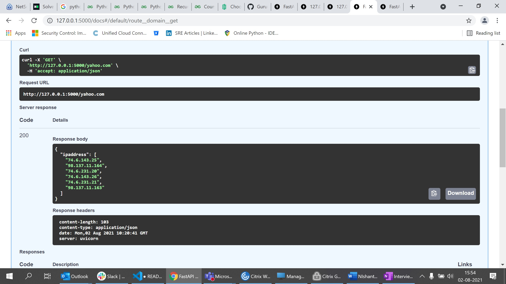

# DNS_API-using-FastAPI

  This is an implementation of DNS API using FastAPI

  FastAPI allows the asynchronous programming and has out-of-the box support for the Swagger docs

### Usage
 
  1. Execute the program in a Linux 
  2. The program runs in 127.0.0.1 with port 5000
  3. Connect to the program from browser and provide the domain name
  ```
     Eg.. curl -kv http://127.0.0.1:5000/yahoo.com
  ```

  4. The API provides as response as below:
  ```
    
{
  "ipaddress": [
    "74.6.231.21",
    "74.6.231.20",
    "74.6.143.26",
    "74.6.143.25",
    "98.137.11.164",
    "98.137.11.163"
  ]
}

  ```

Execute through Swagger docs:




Dependencies:
------------
   - Python 3.6+
   - FastAPI


